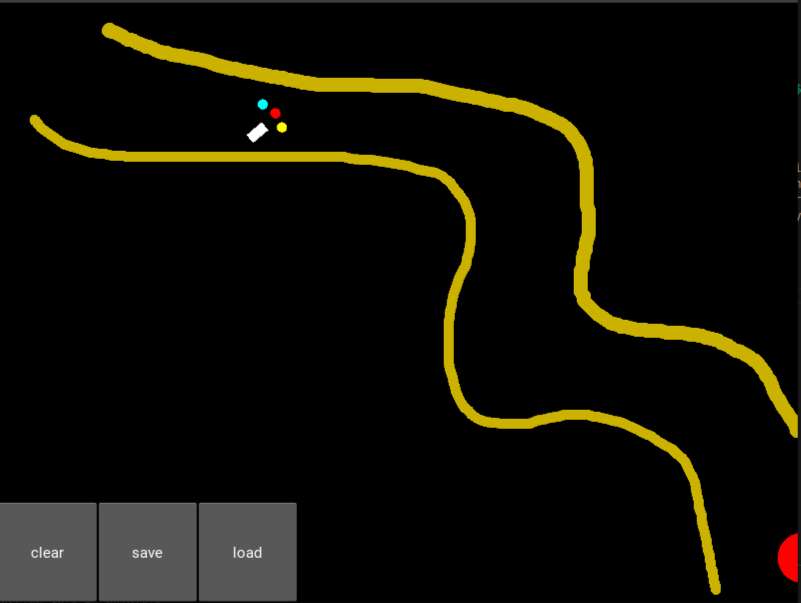

# Point-to-Point Navigation with Deep Reinforcement Learning
In  recent  years,  mobile  robotics  has  experienced  unprece-dented growth. Most of the methods concerning trajectory es-timation are based on automatic laws. A very robust methodis the linearizing loop control method. But in some cases thismethod has to be reworked,  because it has to be linearisedaround a working point or other. Another very robust methodis that of potential fields, since it also allows to avoid certainobstacles that could appear spontaneously on the way to therobot.   But for this type of method it is often necessary toimplement other layers that allow to find the path to reach apoint in the defined space.  Most of the time it is also nec-essary to develop a finite state machine to manage the highlevel of the robot.   Usual methods are therefore very time-consuming  to  implement  and  can  lead  to  mistakes.   More-over, once the control of the robot is set up, optimisation isdifficult.  With the progress of deep learning, a new controlapproach has emerged: deep reinforcement learning. The ad-vantage of this method is that once the method is set up it canbe generalised to many problems and it is only necessary tochange certain parameters.  Also this method is permanentlyoptimized.  In this article, I expose my work which has al-lowed me to train a model to make decisions to orientate a carso that it is able to go from point A to point B as quickly aspossible by avoiding objects that appear as they go along. To train the model I use the A2C (Advantage Actor Critic) al-gorithm which uses the principle of reinforcement learning.

## Modelisation

### Formalisme
The objective of our work is to automate a car so that it is able to go from point A to point B while avoiding obstacles.
The kinematics of the car is modelled by the following equations:

$$
 \dot{x} = v\cos{\phi} \\
 \dot{x} = v\sin{\phi} \\
 \phi=u_{\pi_{\theta}} \\
 v = k \\

 
$$
At first, I tried to control only the steering angle of the car. Thus $u_{\pi_{\theta}}$ represents the $\phi$ output taken via a policy $\pi_{\theta}$.
The robot is also equipped with three sonars, one frontal and two lateral, which allow to visualize its environment.

### Simulation
Once the kinematics were defined, I had to simulate the robot and obtain a visual rendering. I used the Kivy library of python. 
Kivy is a free and open source Python framework for developing mobile apps and other multitouch application software with a natural user interface.
The objective was to have a visual rendering of the robot's evolution, but also to be able to interact with the environment via a man-machine interface. 
Once the simulation is launched, a window opens and the robot evolves in its environment. The operator can interact with the robot's environment by creating walls that he can draw with the mouse. 
There is also a button to erase all the walls on the map to rebuild others and see if the robot is able to generalise its behaviour in any type of environment.

    

As can be seen in the figure. The car is represented by a white square. The sonars of the car are represented by the three circles at the front of the car

The walls are represented by the yellow lines. And the objective of the robot is represented by the red dot. 
At first, the robot can cross walls but when it does so its speed decreases and it gets a negative reward because it has crossed the wall and because it will arrive less quickly at its target.

## Dependencies
kivy 

tensorflow 2.0

## Execute
        python3 map_tensorflow.py

## Experimental

### Only one obstacle
[]

### Multiple obstacles
[]

### Following a path
[]

### The U problem

[]